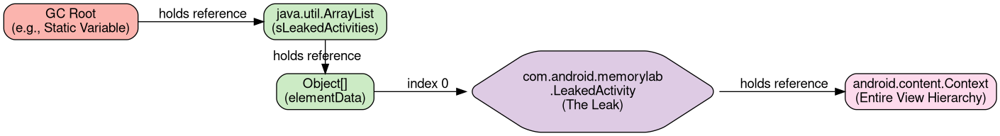
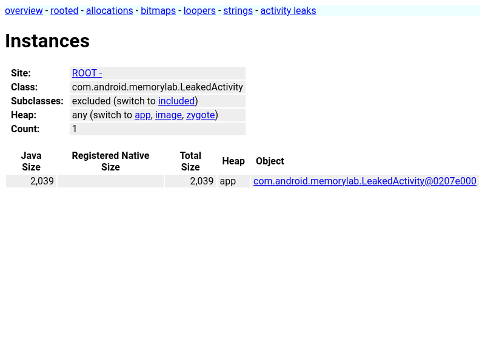
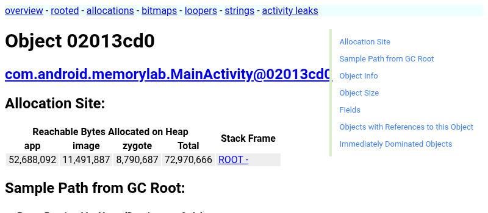
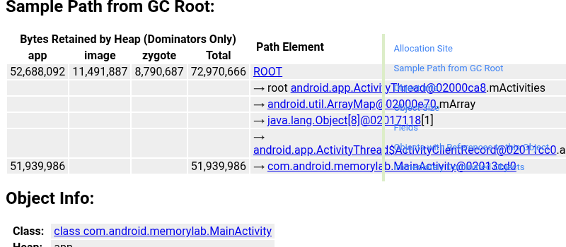

# Analyzing Java Memory

Java and Kotlin applications manage memory through a garbage-collected heap.
When objects are no longer reachable, the garbage collector (GC) eventually
reclaims their space. Memory leaks occur when objects that are no longer needed
are still held by "GC roots," preventing them from being reclaimed.

The following diagram illustrates how a "GC root" can keep an entire tree of
objects alive in memory, even if the application no longer needs them.



<!--
Source for the above diagram is located at: images/java-memory/gc_root_leak.dot
To regenerate: `dot -Tpng images/java-memory/gc_root_leak.dot -o images/java-memory/gc_root_leak.png`
-->

## Setup Instructions for Exercises

Throughout this guide, we will use the **MemoryLab** sample application to
demonstrate memory concepts. Before starting the exercises, ensure your device
is connected with `adb root` and build the app:

```bash
# From the root of your AOSP checkout
source build/envsetup.sh
lunch <your_target_device>-userdebug

adb root
adb wait-for-device

m MemoryLab ahat
adb install -r $OUT/system/app/MemoryLab/MemoryLab.apk
```

## Obtaining Java Heap Dumps

A heap dump is a snapshot of all objects in the Java heap at a specific point in
time.

### Using ADB

To capture a heap dump from a running process, you can pass the package name
directly to `am dumpheap`.

*Note: In modern Android versions, bitmap pixel data is stored in the native
heap. To tell the system to include a snapshot of this native bitmap data inside
the Java heap dump (which is essential for AHAT to analyze bitmaps), you must
pass the `-b` flag.*

```bash
# 1. Trigger the dump (the command takes a moment to complete):
adb shell am dumpheap -g -b png com.android.memorylab /data/local/tmp/heap.hprof

# 2. Pull the file to your development machine:
adb pull /data/local/tmp/heap.hprof .
```

### Using Perfetto

Perfetto can also capture Java heap dumps as part of a system-wide trace by
enabling the `android.java_hprof` data source in your Perfetto config. This is
useful for correlating heap state with other system events.

*Important: Unlike standard `.hprof` files, Perfetto's Java heap dumps only
capture the **object reference graph**, not the actual data contents of fields
(like strings or byte arrays). Furthermore, **AHAT cannot load Perfetto-trace
files**; you must view them in the [Perfetto UI](https://ui.perfetto.dev).*

To capture a heap dump for the MemoryLab app using Perfetto, you can use the
following command:

```bash
external/perfetto/tools/record_android_trace -o java_heap.perfetto-trace -t 10s \
  -c - <<EOF
data_sources: {
    config {
        name: "android.java_hprof"
        java_hprof_config {
            process_shard_config {
                package_name: "com.android.memorylab"
            }
        }
    }
}
EOF
```

See:
[Java heap dumps on Perfetto docs](https://perfetto.dev/docs/data-sources/java-heap-profiler).

## Analyzing with AHAT

AHAT (Android Heap Analysis Tool) is the recommended tool for viewing `.hprof`
files in a web browser.

### Installing AHAT

If `ahat` is not in your path, you can build it from the Android source tree:

```bash
m ahat
# The compiled jar is located at:
# out/host/linux-x86/framework/ahat.jar
```

**Googlers**: You can also visit `go/ahat` to download a prebuilt jar.

### Starting AHAT

Run AHAT using `java -jar` on the compiled artifact:

```bash
java -jar out/host/linux-x86/framework/ahat.jar heap.hprof
```

Then open your browser to [http://localhost:7100](http://localhost:7100).

### Key Analysis Workflows

-   **Finding Leaks**: Search for your Activity class (`MainActivity`) in the
    **Objects** or **Classes** view.



-   Click on a specific `MainActivity` instance to inspect it.



-   In the instance view, you can find the **Path from Root**, which shows the
    chain of references preventing the object from being garbage collected.



-   **Analyzing Bitmaps**: AHAT has special support for viewing
    `android.graphics.Bitmap` objects, which are often large memory consumers.
    Click on a Bitmap instance to see a rendered preview of its contents.

-   **Diffing Dumps**: Comparing two heap dumps is an excellent way to identify
    leaks by seeing which objects are growing over time.

    1.  **Baseline**: Take a heap dump after the app starts (`heap_1.hprof`).
    2.  **Action**: In the MemoryLab app, tap **Trigger Java Memory Leak** or
        **Allocate Java Objects**.
    3.  **Final**: Take a second heap dump (`heap_2.hprof`).
    4.  **Compare**: Start AHAT with the second dump as primary and the first as
        the baseline:

    ```bash
    java -jar ahat.jar --baseline heap_1.hprof heap_2.hprof
    ```

    In the resulting view, AHAT will highlight objects that were added or
    increased in size between the two snapshots.

## Analyzing Java Allocation Churn

Even if your application doesn't permanently leak memory, frequent allocation
and immediate deallocation of temporary objects—known as "allocation churn"—can
cause significant performance problems. The Garbage Collector (GC) has to run
constantly to clean up these discarded objects, which consumes CPU cycles,
drains the battery, and can lead to UI jank (dropped frames).

### Identifying Churn with Perfetto

You can observe the *effects* of allocation churn using **Perfetto**. When
recording a trace, ensure that **Memory Counters** are enabled along with the
`dalvik` **Atrace** category. See the included Perfetto configuration:
[configs/java_churn.pbtxt](configs/java_churn.pbtxt).

### Profiling Java Allocation Churn

1.  **Launch the app**:

    ```bash
    adb shell am start -W -n com.android.memorylab/.MainActivity`
    ```

2.  **Start a Perfetto trace**: Run a targeted trace command focused
    specifically on Dalvik and memory. Adding the `sched` category helps ensure
    thread names (like `HeapTaskDaemon`) are properly captured:

    ```bash
    external/perfetto/tools/record_android_trace -o java_churn.perfetto-trace \
    -t 15s -b 32mb dalvik am res memory sched
    ```

3.  **Generate Churn**: While the trace is running, tap the **Generate Java
    Allocation Churn** button.

4.  **Analyze the Trace**: Open the Perfetto trace file in the
    [Perfetto UI](https://ui.perfetto.dev).

    Expand `com.android.memorylab` and look for these key tracks:

    -   **The `Heap size (KB)` Track**: Under your process's memory section,
        this track will show a rapid "sawtooth" pattern. The memory spikes up as
        you allocate objects, and immediately drops when the GC runs.
    -   **The `mem.rss.anon` Track**: Unlike the heap size, the actual physical
        memory used by the process (`rss.anon`) may not grow significantly,
        because the GC is constantly reclaiming the space within the heap before
        the OS needs to allocate more physical pages.
    -   **The `HeapTaskDaemon` Thread**: Look at the threads within your
        process. You will see near-constant activity on the `HeapTaskDaemon`
        thread, which is ART's background garbage collector working hard to keep
        up with the churn.


In the trace above, the `Heap size (KB)` track displays a classic "sawtooth"
pattern. As the `AllocationChurn` thread allocates objects, the heap size climbs
steadily. Once it hits a threshold, the ART garbage collector (`HeapTaskDaemon`
thread) wakes up to reclaim the discarded objects, causing the sharp drops in
heap size. Notice that while the heap size fluctuates wildly, the physical
memory (`mem.rss.anon`) stays relatively flat because the memory is being reused
before new physical pages are needed from the OS. This highlights how allocation
churn wastes CPU cycles and battery life on constant garbage collection, even if
it doesn't cause an Out-Of-Memory error.

Note: Trace patterns, such as the exact sawtooth frequency or RSS growth,
demonstrate general trends but will vary significantly based on device
characteristics, available RAM, and ART garbage collection settings.

## Monitoring Historical OOMs (ApplicationExitInfo)

Catching an LMK as it happens is great for active debugging, but for field
telemetry, you can use the `ApplicationExitInfo` API. This allows your app to
discover why it was terminated in a previous session.

```java
ActivityManager am = getSystemService(ActivityManager.class);
List<ApplicationExitInfo> exitReasons = am.getHistoricalProcessExitReasons(null, 0, 1);
if (!exitReasons.isEmpty()) {
    ApplicationExitInfo info = exitReasons.get(0);
    if (info.getReason() == ApplicationExitInfo.REASON_LOW_MEMORY) {
        // App was killed by the system Low Memory Killer
    }
}
```

## Best Practices

1.  **Baseline First**: Always take a "baseline" heap dump after the app has
    initialized but before performing the action you're testing.
2.  **Use AHAT's Activity Leaks Page**: AHAT includes a dedicated **Activity
    Leaks** page that automatically identifies Activity instances that have been
    destroyed but are still held in memory. This is often the fastest way to
    find common leaks.
3.  **Check Path to GC Roots**: For any leaked object, use the **Path from
    Root** view in AHAT to understand exactly which reference is keeping it
    alive (e.g., a static field, a long-running thread, or a registered
    listener).

________________________________________________________________________________

**Next: [Analyzing Native Memory](native-memory.md)**
