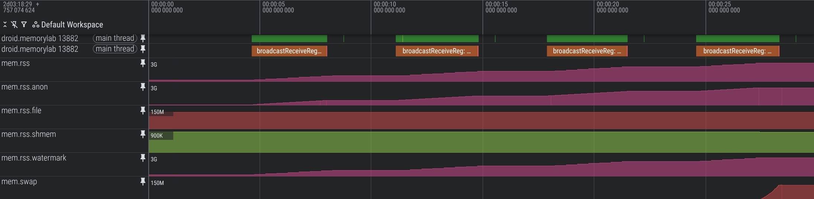

# System-wide Troubleshooting

Memory issues often involve multiple components across the entire system.
Understanding how the kernel manages memory and how processes compete for
resources is key to resolving complex issues.

## Perfetto for System Analysis

Perfetto is the primary tool for system-wide analysis. It allows you to record a
trace that includes:

-   **Process Memory Counters**: `rss.anon`, `rss.file`, and `swap` for every
    process.
-   **Kernel Stats**: Information from `/proc/vmstat` and `/proc/meminfo`.
-   **PSI (Pressure Stall Information)**: Detailed metrics on how much processes
    are stalled due to memory pressure.
-   **LMK Events**: When and why the Low Memory Killer decided to terminate a
    process.
-   **Scheduling**: Correlate memory reclaim activity (`kswapd`) with CPU usage.

## Memory Counters in Perfetto

When viewing a trace, expand a process to see its memory counters:



-   **`mem.rss.anon`**: Anonymous memory (dirty memory not backed by a file).
    This is usually the most important metric to track for leaks.
-   **`mem.rss.file`**: File-backed memory (clean memory mapped from APKs, DEX,
    or libraries).
-   **`mem.swap`**: Memory moved to ZRAM.
-   **`mem.virt`**: Virtual address space size (VSZ). Useful for detecting
    extreme address space fragmentation.
-   **`Heap size (KB)`**: The sum of sizes of allocations in the Java heap.

## Analyzing Graphics Caches

Modern Android UI rendering uses significant memory for caches (bitmaps,
shaders, layers). Use `dumpsys gfxinfo` to see how much memory your app's UI
toolkit is holding:

```bash
adb shell dumpsys gfxinfo <package_name>
```

## Pressure Stall Information (PSI)

PSI tells you how much time the system (or a specific process) spent waiting for
memory resources.

-   **`some`**: At least one process was stalled waiting for memory.
-   **`full`**: All non-idle processes were stalled simultaneously. This
    indicates a severe bottleneck.

You can inspect PSI values via ADB:

```bash
adb shell cat /proc/pressure/memory
```

## Low Memory Killer (LMK)

The LMK is responsible for killing processes to free up memory when the system
is under pressure. If a kill event occurs while you are recording a system-wide
trace, you will see a global `oom_kill` track.

### Monitoring LMK Activity

You can see LMK events in the logs. On modern Android versions, the userspace
`lmkd` daemon logs to `logcat`, while the kernel-level `oom_kill` events are
logged to `dmesg`.

```bash
# Check userspace LMKD
adb logcat | grep -i "lmkd"

# Check kernel OOM killer
adb shell dmesg | grep -i "oom_kill"
```

In Perfetto, LMK events appear as markers in the system-wide tracks. Each event
includes the PID of the killed process and the reason (e.g., "cache too low").

## kswapd and Direct Reclaim

`kswapd` is a kernel thread that runs when free memory falls below a certain
threshold. It attempts to reclaim memory in the background.

-   **High `kswapd` CPU usage**: Indicates the system is constantly struggling
    to find free pages.
-   **Direct Reclaim**: If `kswapd` cannot keep up, processes themselves will be
    forced to reclaim memory synchronously before they can proceed with their
    own allocations. This shows up as "Direct Reclaim" events in Perfetto and
    significantly impacts performance.

## Analyzing Traces with PerfettoSQL

If you cannot access the Perfetto Web UI, you can use the `trace_processor` CLI
to query trace data directly using SQL.

### Starting trace_processor

1.  Download the `trace_processor` binary:

    ```bash
    curl -LO https://get.perfetto.dev/trace_processor
    chmod +x trace_processor
    ```

2.  Run it in interactive mode with your trace:

    ```bash
    ./trace_processor trace.perfetto-trace
    ```

### Useful SQL Queries

-   **List all Out-Of-Memory / LMK kills**:

    ```sql
    SELECT ts, name, value FROM counter
    JOIN track ON counter.track_id = track.id
    WHERE name = 'oom_kill'
    ```

-   **Get average RSS for a process**:

    ```sql
    SELECT
      p.name,
      avg(c.value) / 1024 / 1024 as avg_rss_mb
    FROM counter c
    JOIN process_counter_track t ON c.track_id = t.id
    JOIN process p USING (upid)
    WHERE t.name = 'mem.rss.anon' AND p.name = '<your_process_name>'
    ```

-   **Identify memory-heavy processes**:

    ```sql
    SELECT
      p.name,
      max(c.value) / 1024 / 1024 as max_rss_mb
    FROM counter c
    JOIN process_counter_track t ON c.track_id = t.id
    JOIN process p USING (upid)
    WHERE t.name = 'mem.rss.anon'
    GROUP BY p.name
    ORDER BY max_rss_mb DESC
    LIMIT 10
    ```

________________________________________________________________________________

**[Main page](README.md)**
